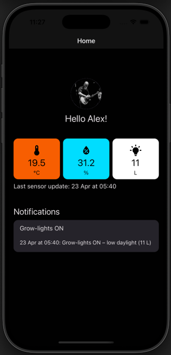
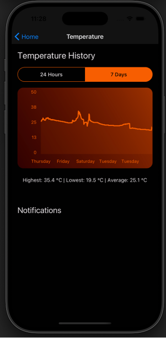
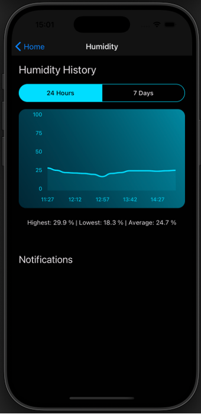
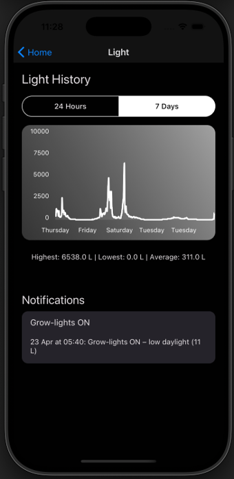
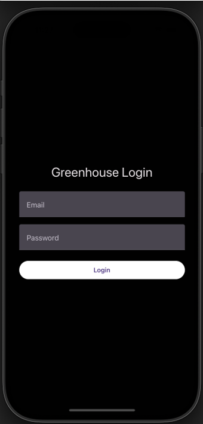
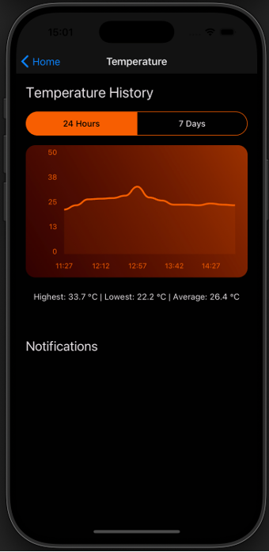
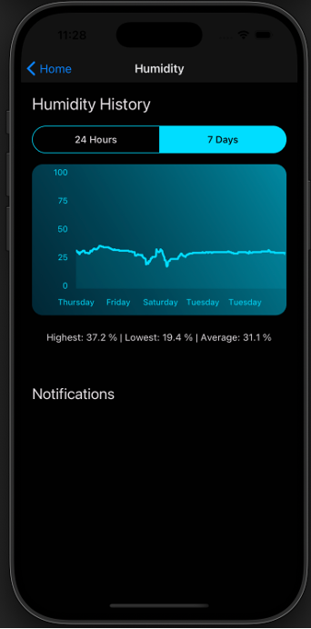
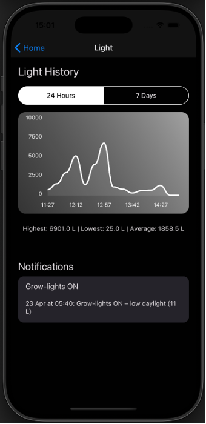

# iot-greenhouse-controller

This repository contains a prototype system designed to help hobby gardeners monitor and maintain optimal conditions in a personal greenhouse. It integrates sensor data collection on an ESP32 microcontroller with a cross-platform mobile application built using React Native. The app displays real-time and historical environmental data, enabling users to keep track of temperature, humidity, and light levels.

## Preview

A quick look at the mobile application:

  
  
  
  

## Project Overview
Managing a greenhouse requires constant monitoring of environmental conditions to ensure healthy plant growth.  
This project demonstrates how IoT technology can support hobby gardeners by providing real-time monitoring, historical analysis, and simulated automation features.
 

## What Is It?
The IoT Greenhouse Controller aims to:

- Collect real-time data on temperature, humidity, and light using an ESP32-S3-MINI-1 microcontroller with a SHT-31 sensor for temperature/humidity and an LTR329ALS sensor for light.
- Send the collected data to a Firebase Realtime Database for storage and synchronization.
- Provide a React Native mobile application (built with Expo) to display both real-time and historical sensor readings.
- Simulate control actions by sending push notifications (via Expo Notifications) when certain thresholds (e.g., low temperature, high humidity) are crossed.
- Although the prototype does not directly control any physical devices, it simulates actions such as turning lights on/off or adjusting ventilation, illustrating how full automation could be integrated in a future version.  
## How It Works
1. **ESP32 firmware** polls sensors and pushes readings to Firebase every 15 minutes.  
2. **Firebase** stores data in a structured, time-stamped format.  
3. **React Native app** subscribes to updates and shows data and charts.  
4. **Expo Notifications** sends notifications when thresholds are exceeded, simulating automated greenhouse controls.  

## Features
### Monitoring
- View temperature, humidity, and light readings from the greenhouse at 15-minute intervals. This approach minimizes data usage while still offering timely insights into changing conditions.

### Historical Data Visualization
- Explore trends over time through history charts. This helps you identify patterns or recurring issues in the greenhouse environment.
- Summary below charts provides highest, lowest, and average values—optimized for screen reader users.

### Push Notifications (simulated automation)
- Receive alerts for conditions that fall outside your configured thresholds (e.g., low light during winter days or low temperatures).
- Implemented using Expo Notifications, but notifications only show when the app is open (current limitation).

### Accessibility and Universal Design
- Built with a focus on inclusive design to ensure the app can be used by the widest possible audience.
- High-contrast color logic ensures readable text over sensor cards.
- Color-coded cards improve usability for users with low vision or dyslexia.
- Historical charts are screen-reader friendly via accessible labels.

### Cross-Platform
- Built with React Native and Expo, so the application runs on both Android and iOS devices.  
 

## Technology Stack
### Hardware:
- ESP32-S3-MINI-1
- SHT-31 Sensor (temperature/humidity)
- LTR329ALS Light Sensor
  
### Backend & Cloud Services:
- Firebase Realtime Database
- Firebase Authentication

### Mobile App:
- React Native and Expo for cross-platform development
  - UI Libraries:
    - React Native Paper for ready-made and accessible UI components
    - react-native-chart-kit for rendering charts of historical data
    - Expo Notifications (alerts)

### Programming Languages:
- C++ for the microcontroller firmware
- JavaScript/TypeScript for the mobile application  
 

---

## Screenshots & Walkthrough

### 1. Login Screen
  
Simple login form with email & password (future versions could add Google login).

---

### 2. Home Screen
  
Shows current sensor readings in color-coded cards (orange = temperature, blue = humidity, white = light) that also functions as buttons that navigate to the corresponding sensor history page.  
Includes a timestamp and a scrollable list of recent notifications.

---

### 3. Temperature History

    
    

Line charts display historical data for 24h or 7d.  
Screen reader users can skip charts and read textual summaries of min, max, and average values.

---

### 4. Humidity History

    
    

Identical layout as the temperature screen, but with humidity data and blue color scheme.

---

### 5. Light History

    
    

Light intensity over time, shown in white/neutral color scheme.  
Includes accessible text summaries and related notifications.

---

## Possible Future Improvements
- Customizable thresholds for alerts.  
- Manual “control” buttons (e.g., simulate turning on lights).   
- Smarter logic for light alerts (avoid night-time false alarms).  
- Full accessibility testing with screen readers.  

